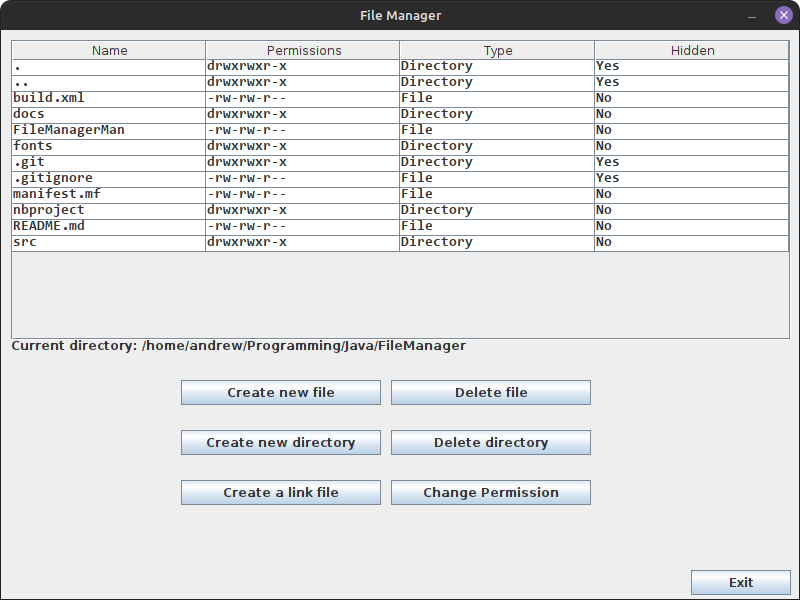

# FileManager
- File Manager is a Linux application that can do basic operations on files and directories
- Operations this app can do:
  * Create, rename, delete or change permissions of files and directories
  * Show the current working directory
  * Show all files and directories on the current working directory
- This app was built using Java and Java swing GUI library, and it was a faculty assignment.

## Images:

